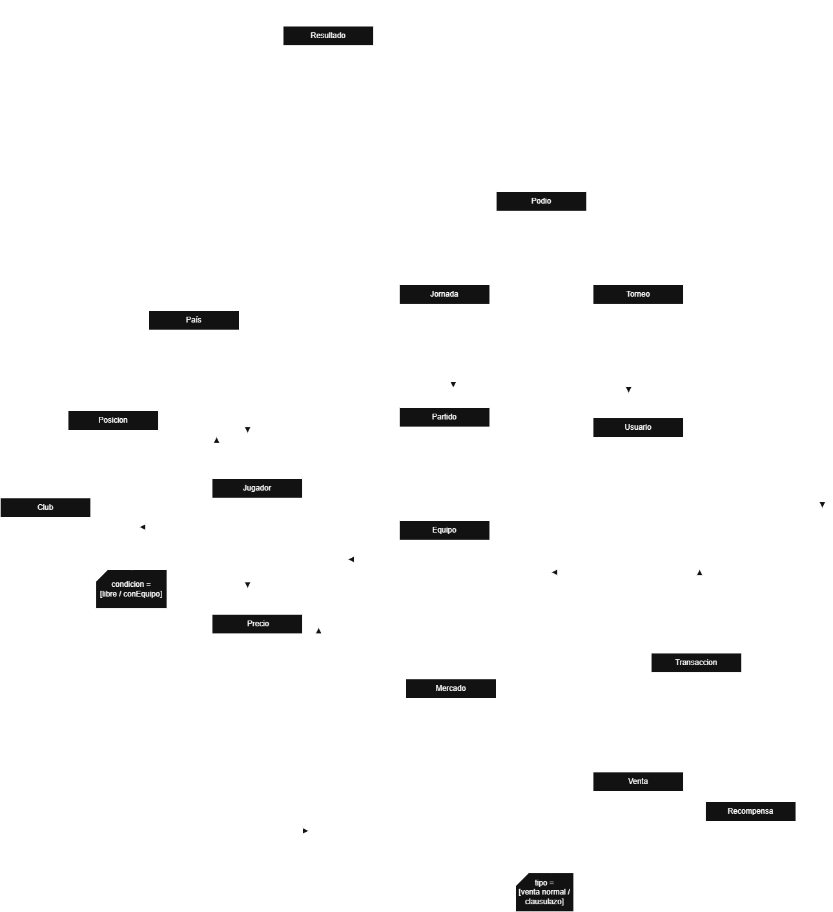

# Propuesta TP DSW

## Grupo
### Integrantes
* 52867 - Mazalan, Ariel Ignacio
* 52831 - Pacheco, Santiago Tomas
* 52309 - Ribotta, Tomas Nicolas

### Repositorios
* [frontend app](https://github.com/TomasRibotta20/FrontEnd_fantasy)
* [backend app](https://github.com/TomasRibotta20/BackEnd_Fantasy)

## Tema
### Descripción

Una aplicacion web de "Fantasy Fubtol" en la cual cada usuario puede construir su propio equipo de 11 jugadores adquiridos desde un mercado basado en la Liga Argentina de Fubtol y afiliarse a una liga con otros usuarios. Estos jugadores iran sumando puntos semanalmente en funcion de su rendimiento en la vida real, que luego seran usados para determinar que usuario conformo el mejor equipo. Cada usuario comenzara con 11 jugadores al azar (que no excedan un market cap especifico) y un pequeño presupuesto. Cada jugador tiene un precio establecido el cual variaria dependiendo de sus ultimas actuaciones en partidos oficiales y tambien dependiendo de su demanda en el mercado. Los usuarios pueden adquirir estos jugadores en un mercado que se actualizara diariamente con jugadores aleatorios, tambien pueden comprarselos a otros usuarios pagando una clausula de rescision. Sumado a esto cada usuario puede vender sus jugadores en el mercado al precio que el mismo tenga en el momento. Al final de la semana se conformara un podio entre los usuarios de una misma liga dependiendo de la cantidad de puntos que tengan, y en base a ese podio se repartiran los distintos premios (diferentes sumas de dinero para la mejora del equipo).

### Modelo

## Alcance Funcional 

### Alcance Mínimo

Regularidad:
|Req|Detalle|
|:-|:-|
|CRUD simple|1. CRUD Usuario 2. CRUD Club 3. CRUD Posición|
|CRUD dependiente|1. CRUD Equipo {depende de} CRUD Usuario y CRUD Jugador 2. CRUD Jugador {depende de} CRUD Posisción y CRUD Club|
|Listado + detalle| 1. Listado de jugadores filtrado por club, muestra jugadores del club y posición del jugador => detalle muestra datos completos de jugador  2. Listado de jugadores filtrado por posición, muestra nombre del jugador y equipo => detalle muestra datos completos de cada jugador|
|CUU/Epic|1. Modificar equipo (En el momento en el cual el usuario desea crear un equipo le coloca un nombre y se creara un equipo con 11 jugadores aleatorios, el cual posteriormente cuando este desee podrá modificar a su gusto ya que en esta instancia del proyecto los jugadores no van a tener un precio ni los usuarios presupuesto) 2. Calcular puntaje para cada jugador (Al final de cada jornada se calculará los puntos para cada jugador dependiendo de su rendimiento individual y se le asignara un puntaje a cada usuario en funcion a su alineación)|

Adicionales para Aprobación
|Req|Detalle|
|:-|:-|
|CRUD |1. CRUD Usuario 2. CRUD Club 3. CRUD Posición 4. CRUD Equipo 5. CRUD Jugador 6. CRUD Precio 7. CRUD Jornada 8. CRUD Partido 9. CRUD Liga|
|CUU/Epic|1. Calcular puntaje para cada jugador 2. Crear torneo (El usuario podra crear un torneo e invitar amigos para jugar contra ellos, ganara el usario que mas puntos saque en cada fecha) 3. Modificar equipo|

### Alcance Adicional Voluntario

|Req|Detalle|
|:-|:-|
|Listados |1. Listados de jugadores filtrados por precio, país, posición y equipo 2. Listado de usuarios de un torneo filtrado por jornadas|
|CUU/Epic|1. Realizar transacción (Comprar/vender juador a otro usuario de ese torneo o al mercado) 2. Generar mercado diario (Habrá una tienda en la cual diariamente apareceran 10 jugadores a precio de mercado y donde los usuarios pueden competir entre ellos para comprarlos) 3. Asignar los premios a los jugadores (Al final de cada jornada los 3 usuarios con mas puntos obtendran un premio en saldo de la aplicacion) 4. Modificar clausula de un jugador (Los usuarios tendran la posibilidad de comprar jugadores de otros usuarios unicamente por clausula de rescision. Cada usuario podra modificar la clausula de rescision de sus jugadores gastando saldo para ello)|

